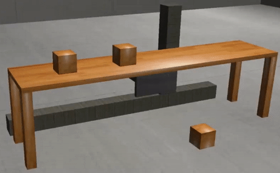
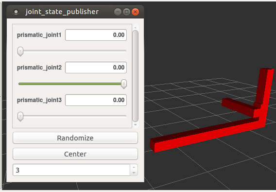
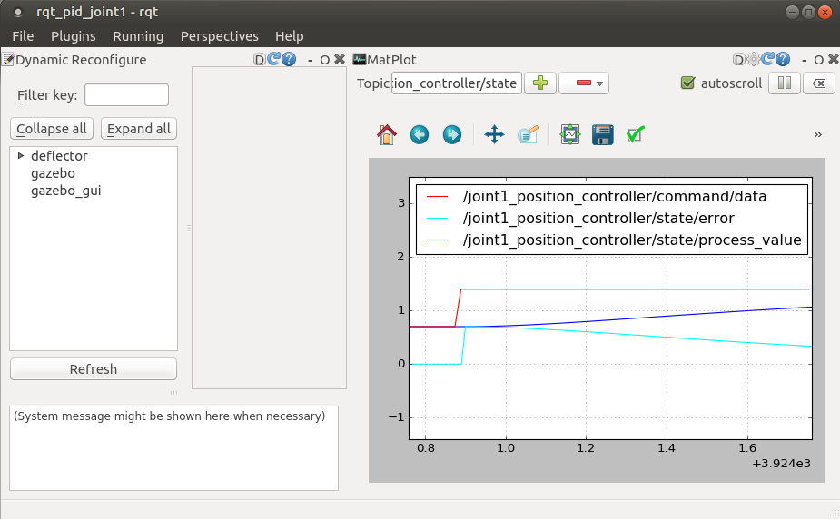

## Deflector Robot
Author: Roberto Zegers R.

A Gazebo simulation of a three degrees-of-freedom cartesian robot.

### Description
This ROS package contains a set of parametrized macros that allow to quickly build custom models of cartesian robots for simulation. The main structural components are three linear actuators oriented perpendicular to each other. The end effector works in the X-Y-Z coordinate space with fixed orientation. The joint space of the robot corresponds directly with the standard right-handed Cartesian xyz-coordinate system, yielding the simplest possible kinematic equations. This makes cartesian robots easy to control or program, but also cost effective and simple to make.
  
With its default robot configuration this package provides a Gazebo model that can function as a sliding sorter or pusher. By positioning its sliding axes in front of an item's location (on a table, storage rack or conveyor belt) it can grab or push that item to a container bin or aftersort lane.     

  
Figure 1: Deflector Robot in action (animated gif can take a while to load).  
  
This implementation includes:    
Robot description using **xacro**, debugging robot model in **Gazebo**, position control with **ROS Control**, a exemplary node to send target joint positions usign a **C++ ROS Publisher** and **RQT** configured for **calibrating PID coefficients**.

### Features
+ Parametric Modeling: each dimention is configurable and integrated to a mathematical model of the robot. Unlimited different robot configurations are possible by changing the parameter values.
+ Structural elements can be modelled using square or rectangular cross sections.
+ Pre-setup GUI to visualize the PID controller's performance.
+ Ready-to-launch ROS demo node to show-case the robot movements in simulation.

### Requirements

+ Ubuntu 16.04 LTS
+ ROS Kinetic
+ Gazebo 7.0
+ ros_control
+ gazebo_ros_control

Note: This package has only been tested on Ubuntu 16.04 LTS with ROS Kinetic and Gazebo 7.0.  

### Installation

Clone this repository into a ROS catkin workspace:
```sh
$ cd catkin_ws/src
$ git clone https://github.com/rfzeg/deflector_robot.git
```

Then build and source the workspace, for instance:

```sh
$ cd catkin_ws
$ catkin_make
$ source devel/setup.bash
```
### Running a Demo Simulation  
To run a demo launching each node in a separate xterm windows use:  
 `./start_demo.sh`   
Alternatively to execute all nodes in one terminal use:  
`roslaunch deflector_robot demo.launch`  

### Optional Checks

On a new terminal run this command to see the existing parameters:

`$ rosparam list`

And check that the parameters defined in the deflector_control.yaml file were loaded into the param server.


Then check that the controller manager is running:
`$ rosservice list | grep controller_manager`

Next, when typing `$ rostopic list`, confirm that several topic like `/deflector/joint1_position_controller/command` display. 

Finally, the robot joints can be verified in Rviz by running:

`roslaunch deflector_robot rviz.launch jsp_gui:=true`  

The joint_state_publisher GUI should appear:

  
Figure 2: The joint_state_publisher GUI, Rviz is shown on the background.  

The sliders of the joint_state_publisher can be used to confirm in Rviz that the movement of each joint is correct.  

### Activate the joints manually

To control the robot joints in Gazebo, a joint value with a message of type **std_msgs/Float64** has to has to be published to one of the joint position controller command topics.
  
For example:  
`$ rostopic pub /deflector/joint1_position_controller/command std_msgs/Float64 "data: 0.5"`  

Where data represents the goal position of the joint in meters.

Note: It is recomended to start typing the command above and press the Tab key until the message auto-completes. If the auto-complete does not work, source your workspace and try again.


The following list shows the joint limits and range of motion measured in meters for the default robot model included in this package:  

+ Joint1 from  0.0 to 2.8, range of motion: 2.8 
+ Joint2 from -0.8 to 0.0, range of motion: 0.8
+ Joint3 from  0.0 to 0.8, range of motion: 0.8

Note that joint 2's movement is in the negative direction of its axis.

### Activate the joints programatically
Please refer to this minimal code implementation in C++:  

```cpp
#include <ros/ros.h>
#include <std_msgs/Float64.h>

int main(int argc, char **argv)
{
  ros::init(argc, argv, "std_msgs_talker");
  ros::NodeHandle n;
  ros::Publisher position_pub = n.advertise<std_msgs::Float64>("/deflector/joint1_position_controller/command", 1000); // set topic name, amount of messages to buffer
  ros::Rate loop_rate(1); // in Hz

while (ros::ok())
  {
    std_msgs::Float64 pos_msg;
    pos_msg.data = 0.5;
    position_pub.publish(pos_msg);
    ros::spinOnce();
    loop_rate.sleep();
  }
  return 0;
}
```

### Visualize and tune the PID's controller performance

The PID controller is supplied configured. However if the weights and physical properties of the links are modified, it will be neccesary to re-calibrate the PID gains to get a good performance.

Tune each axis independently.   
For generating alternating position signals for one axis at a time run:  
`roslaunch deflector_robot position_cmd.launch joint_nr:=1`


**Visualization**  
A configured RQT launch file is included to visualize and evaluate the control loop performance.
To start RQT configured for visualizing position signals for one axis run:  
`roslaunch deflector_robot rqt.launch joint_nr:=1` 

The following window should appear:  
 
Figure 3: RQT with the Dynamic Reconfigure plugin to the left and rqt_plot the right.  

The plot will display following topics in real time to the screen:
+ joint_X_position_controller/command/data
+ joint_X_position_controler/state/process_value
+ joint_X_position_controler/state/error

The command/data value is the set point or target value for the joint.  
The process_value plot shows the current joint position.  
The error plot will visually display how well the PID control eliminates the error between those two. 

**Tunning**  
The panel **Dynamic Reconfigure** can be used to tune the proportional, derivative and integral coefficients (see Figure 2 above). 

Expanding 'deflector' down to the level of PID exposes sliders for the control gains.
These will be initialized to the values in the control-parameter YAML file.
They can be adjusted while the robot is running, so one can immediately observe their effects in rqt_plot.

One technique for tuning a PID loop is:
1. Set all gains to zero
2. Adjust Kp as high as you can without inducing wild oscillation (steady oscillations are ok)
3. Increase Kd to remove overshoot
4. Finally adjust Ki to remove any residual offset after the loop has settled 

Note that while it is very difficult to get to a perfect tune, it is not too difficult to achieve a tune that is good enough for most use cases.  

### Further work  

Add AndyZe's autotune node in ordert to tune the PID controller with the Ziegler Nichols method.  
Reference: [uzgit/pid](https://github.com/uzgit/pid/tree/master)  

### Troubleshooting
If the package build fails due to an "Could not find a package configuration file provided by 'controller_manager'" error message, then the controller_manager package is not installed.  
Use:  
`$ sudo apt-get install ros-kinetic-ros-control ros-kinetic-ros-controllers`
and then install:  
`$ sudo apt install ros-kinetic-gazebo-ros-control`  

### Resources
+ http://gazebosim.org/tutorials/?tut=ros_control
+ http://gazebosim.org/tutorials?tut=gravity_compensation
+ http://wiki.ros.org/roscpp/Overview/Parameter%20Server
+ http://wiki.ros.org/rqt
